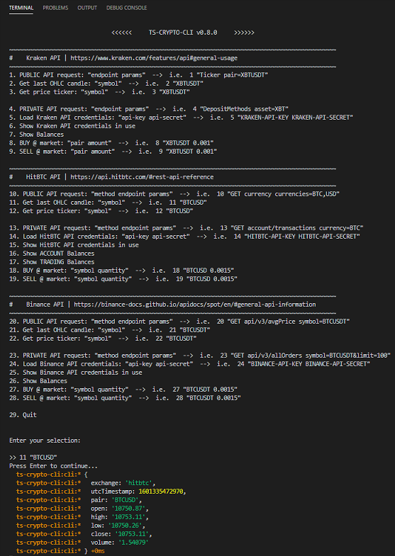

  

# TS Crypto Cli

> A handy npm to operate against some of the most known Crypto Exchanges

## Environment Variables

```
# Each REST request/response will be recorded to a log file if you set this path
TS_CRYPTO_CLI_LOGS_PATH=D:\DESKTOP\ts-crypto-cli_logs

KRAKEN_API_KEY=<...>
KRAKEN_API_SECRET=<...>

HITBTC_API_KEY=<...>
HITBTC_API_SECRET=<...>

BINANCE_API_KEY=<...>
BINANCE_API_SECRET=<...>
```

## Use it as a library

- `yarn add ts-crypto-cli`

### REST APIs

- [Kraken Public](https://yeikiu.github.io/ts-crypto-cli/modules/_kraken_public_api_request_.html)
- [Kraken Private](https://yeikiu.github.io/ts-crypto-cli/modules/_kraken_private_api_request_.html)
- [HitBTC Public](https://yeikiu.github.io/ts-crypto-cli/modules/_hitbtc_public_api_request_.html)
- [HitBTC Private](https://yeikiu.github.io/ts-crypto-cli/modules/_hitbtc_private_api_request_.html)
- [Binance Public](https://yeikiu.github.io/ts-crypto-cli/modules/_binance_public_api_request_.html)
- [Binance Private](https://yeikiu.github.io/ts-crypto-cli/modules/_binance_private_api_request_.html)

### WS APIs

- [Kraken Public](https://yeikiu.github.io/ts-crypto-cli/modules/_kraken_public_ws_handler_.html)
- [Kraken Private](https://yeikiu.github.io/ts-crypto-cli/modules/_kraken_private_ws_handler_.html)
- [HitBTC Public](https://yeikiu.github.io/ts-crypto-cli/modules/_hitbtc_public_ws_handler_.html)
- [HitBTC Private](https://yeikiu.github.io/ts-crypto-cli/modules/_hitbtc_private_ws_handler_.html)
- [Binance Public](https://yeikiu.github.io/ts-crypto-cli/modules/_binance_public_ws_handler_.html)
- Binance Private (TODO, WIP)

### Handling multiple API credentials

You can handle different API keys/secrets under the same exchange. Generate the new API client instances with the following methods:

- [`createKrakenPrivateApiClient`](https://yeikiu.github.io/ts-crypto-cli/modules/_kraken_private_api_request_.html#createkrakenprivateapiclient)
- [`createHitBTCPrivateApiClient`](https://yeikiu.github.io/ts-crypto-cli/modules/_hitbtc_private_api_request_.html#createhitbtcprivateapiclient)
- [`createBinancePrivateApiClient`](https://yeikiu.github.io/ts-crypto-cli/modules/_binance_private_api_request_.html#createbinanceprivateapiclient)


#### Demo

Here is a little handler to perform a 2-steps withdrawal from Kraken in 20 lines of code using the lib.

```typescript
import { krakenPrivateApiRequest } from 'ts-crypto-cli';

const krakenWithdrawAsset = async (asset: string, key: string, withdrawAmount: number): Promise<void> => {

  const withdrawInfo = await krakenPrivateApiRequest({ url: 'WithdrawInfo', data: {
      asset,
      key,
      amount: withdrawAmount
  }})

  const { limit } = withdrawInfo

  if (Number(limit) < Number(withdrawAmount)) {
    throw new Error(`Can´t withdraw ${withdrawAmount} ${asset}. Max. available ${limit}`)
  }

  krakenPrivateApiRequest({ url: 'Withdraw', data: {
    asset,
    key,
    amount: withdrawAmount
  }})
};

export {
  krakenWithdrawAsset
}
```

---

## Launch the REPL cli on a shell



### With a .env file

> Update the .env file with your own credentials and run

- `npx ts-crypto-cli`

OR

- `npx ts-crypto-cli -dotenv dotenv_config_path=/custom/path/to/your/env/vars`

if your .env file is not under current `pwd`

### Inject your keys/secrets to enable private methods

> This method is more secure as you won´t persist the KEYS to a file

#### Powershell (windows)

- `$env:KRAKEN_API_KEY="<...>" ; $env:KRAKEN_API_SECRET="<...>" ; $env:HITBTC_API_KEY="<...>" ; etc... ; npx ts-crypto-cli`

#### cmd (windows)

- `set KRAKEN_API_KEY=<...> & set KRAKEN_API_SECRET=<...> & set HITBTC_API_KEY=<...> $ etc... & npx ts-crypto-cli`

#### Unix/OSx

- `KRAKEN_API_KEY=<...> KRAKEN_API_SECRET=<...> HITBTC_API_KEY=<...> npx ts-crypto-cli`
