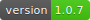
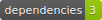
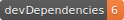

  

TS Kraken API
=============

> TS kraken.com API client library for NodeJS

This is an asynchronous NodeJS client for the kraken.com API.

It exposes all the API methods found here: https://www.kraken.com/help/api through 2 separated exported modules: `KrakenClient.publicRequest` and `KrakenClient.privateRequest`

## Installation
  `yarn add ts-kraken-api` OR `npm i ts-kraken-api`

## Usage

### Public method's

```typescript
import { KrakenClient, KrakenPair } from 'ts-kraken-api';

const { publicRequest } = KrakenClient;

// Get last BTC/USD ticker
const pair: KrakenPair = 'XXBTZUSD';

(async () => {
  const { data } = await publicRequest('Ticker', { pair });
  const { result } = data;
  console.log({ result });
})();
```


### Private method's

```typescript
import { KrakenClient } from 'ts-kraken-api';

const { privateRequest } = KrakenClient;

// environment vars (you can use a .env file)
process.env.KRAKEN_API_KEY = 'YOUR_API_KEY';
process.env.KRAKEN_API_SECRET = 'YOUR_API_SECRET';

// Get current Kraken account Balance
(async () => {
  const { data } = await privateRequest('Balance');
  const { result } = data;
  console.log({ result });
})();
```


## Credits

Thanks to @nothingisdead, I used his JS client as a base repo https://github.com/nothingisdead/npm-kraken-api 
